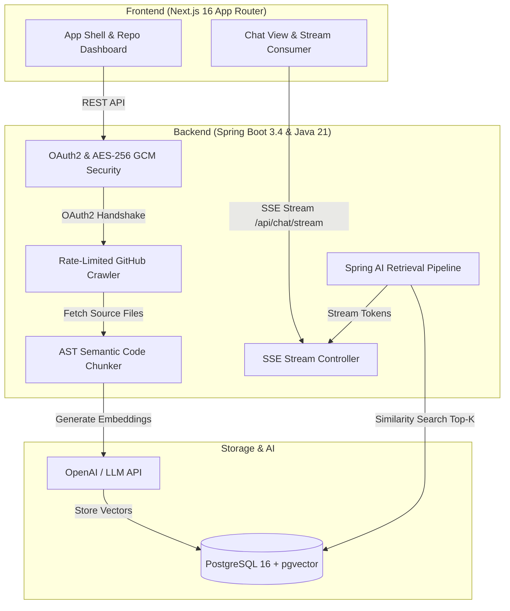

<p align="center">
  
</p>

<p align="center">
  <strong>The architectural narrative engine for complex codebases.</strong><br/>
  Interrogate repositories, trace execution paths, and inspect AST-grounded answers with verifiable citations.
</p>

<p align="center">
  <a href="LICENSE"></a>
  <a href="https://adoptium.net/"></a>
  <a href="https://spring.io/projects/spring-boot"></a>
  <a href="https://spring.io/projects/spring-ai"></a>
  <a href="https://nextjs.org/"></a>
  <a href="https://github.com/pgvector/pgvector"></a>
</p>

---

## The Concept

Code isn't prose; it is an interconnected graph of intents, boundaries, and trade-offs. Reading code linearly like a book rarely works when onboarding onto multi-thousand-line microservices or unfamiliar monoliths.

**PlotTwist** unravels the story behind any repository. By pairing abstract syntax tree (AST) chunking with PostgreSQL `pgvector` embeddings and Spring AI retrieval, PlotTwist turns codebase interrogation into a grounded conversational dialogue.

Every answer is verified against actual files, streaming token-by-token directly to your screen with clickable line citations.

```
Traditional Code Exploration            With PlotTwist
─────────────────────────────           ─────────────────────────────────────
• Blind regex grepping                  • AST-aware semantic retrieval
• Guessing cross-file dependencies      • Top-K cosine similarity matching
• Stale wiki documentation              • Line-by-line verified citations
• Context loss across commits           • Real-time SSE token streaming
```

---

## Design Highlights

### 1. AST-Aware Semantic Chunking
Naive token splitting cuts through class definitions and mid-expression statements, destroying the context the model needs. PlotTwist’s ingestion engine respects language syntax boundaries—grouping classes, method declarations, and module interfaces into unified semantic units.

### 2. High-Dimensional Vector Space (`pgvector`)
Chunks are embedded and indexed into PostgreSQL using the `pgvector` extension with Hierarchical Navigable Small World (`HNSW`) indexing. Searches run in sub-second time with cosine distance scoring and metadata filtering.

### 3. Clickable Source Citations
No hallucinations or unverifiable claims. PlotTwist extracts line-level references from the retrieved chunks and surfaces them as interactive chips (`src/services/Auth.ts:L42-68`) pointing directly to your GitHub repository.

### 4. Zero-Trust Token Encryption
GitHub access tokens are never saved as plain text. Every token is sealed at rest using AES-256 GCM encryption with unique salts derived through PBKDF2.

### 5. Reactive Token Streaming
Responses stream token-by-token using HTTP Server-Sent Events (SSE) from the Spring Boot backend straight to the React interface, providing instant feedback without polling.

---

## Architecture Flow



---

## Stack Specifications

| Layer | Technology | Details |
|---|---|---|
| **Frontend** | Next.js 16 (Turbopack) | React 19, App Router, TypeScript 5 |
| **Styling** | Tailwind CSS v4 | Dynamic OKLCH colors, Base UI primitives |
| **State** | TanStack Query v5 | Server state caching & optimistic updates |
| **Backend** | Spring Boot 3.4+ | Java 21 LTS, Spring Framework 6.2 |
| **AI / RAG** | Spring AI 2.0+ | VectorStore abstraction, OpenAI starter |
| **Security** | Spring Security 6 | OAuth2 Client, AES-256 GCM cryptography |
| **Persistence** | PostgreSQL 16 | `pgvector` extension with HNSW indexing |
| **Container** | Docker Compose | Isolated PostgreSQL container on port `5433` |

---

## Quickstart Guide

### Prerequisites
- **Java 21 LTS** (`Eclipse Adoptium Temurin 21` recommended)
- **Node.js 20+** & **npm**
- **Docker Desktop**
- **GitHub Account** (for OAuth app credentials)
- **OpenAI API Key**

---

### Step 1. Start the Database

Run PostgreSQL with `pgvector` pre-configured:

```bash
docker compose up -d
```

> **Note**: Port `5433` is mapped to avoid conflicting with any default local PostgreSQL instance on port `5432`.

Confirm the container is healthy:
```bash
docker ps --filter "name=plottwist-postgres"
```

---

### Step 2. Register Your GitHub OAuth App

1. Head to **GitHub Settings → Developer settings → OAuth Apps → New OAuth App**.
2. Fill in the required fields:
   - **Application Name**: `PlotTwist`
   - **Homepage URL**: `http://localhost:3000`
   - **Authorization callback URL**: `http://localhost:8080/login/oauth2/code/github`
3. Click **Register application**, generate a **Client Secret**, and note down your **Client ID** and **Client Secret**.

---

### Step 3. Launch the Backend

#### Windows (PowerShell):
```powershell
cd backend

# Point to your Java 21 JDK installation
$env:JAVA_HOME = "C:\Program Files\Eclipse Adoptium\jdk-21.0.4.7-hotspot"

# Set your secrets
$env:GITHUB_CLIENT_ID = "your_github_client_id"
$env:GITHUB_CLIENT_SECRET = "your_github_client_secret"
$env:OPENAI_API_KEY = "your_openai_api_key"

# Run Spring Boot
.\mvnw.cmd spring-boot:run
```

#### macOS / Linux:
```bash
cd backend
export GITHUB_CLIENT_ID="your_github_client_id"
export GITHUB_CLIENT_SECRET="your_github_client_secret"
export OPENAI_API_KEY="your_openai_api_key"

./mvnw spring-boot:run
```

The Spring Boot backend will start on **`http://localhost:8080`**.

---

### Step 4. Launch the Frontend

In another terminal window:

```bash
cd client
npm install
npm run dev
```

Visit **`http://localhost:3000`** in your browser.

---

## Directory Organization

```
plottwist/
├── .github/
│   ├── assets/hero-banner.svg   # Designer SVG header banner
│   └── workflows/ci.yml         # GitHub Actions build pipeline
├── backend/
│   ├── src/main/java/plottwist/backend/
│   │   ├── config/              # Security, CORS, Crypto, Jackson configuration
│   │   ├── controllers/         # REST & SSE streaming endpoints
│   │   ├── dto/                 # Request/response records
│   │   ├── entity/              # JPA models (User, Repository, ChatSession)
│   │   ├── exceptions/          # Centralised error handling
│   │   ├── repository/          # Spring Data JPA repositories
│   │   ├── security/            # OAuth2 principal mapping & token crypto
│   │   └── services/
│   │       ├── ai/              # Prompt builders, context retrievers, SSE handlers
│   │       ├── github/          # Rate-limited repository crawler
│   │       └── indexing/        # AST chunker & pgvector indexer
│   ├── src/main/resources/
│   │   └── application.properties
│   └── pom.xml
├── client/
│   ├── app/
│   │   ├── auth/callback/       # OAuth session landing page
│   │   ├── chat/[repoId]/       # Codebase conversational workspace
│   │   ├── dashboard/           # Repository list & indexing progress
│   │   ├── login/               # Sign-in page
│   │   ├── globals.css          # Design system tokens
│   │   └── page.tsx             # Interactive landing page
│   ├── components/
│   │   ├── chat/                # Composer, markdown renderer, citation chips
│   │   ├── dashboard/           # Repo cards, sync triggers, metrics
│   │   ├── icons/               # PlotTwist SVG brand marks
│   │   └── ui/                  # Base UI component primitives
│   ├── hooks/                   # React Query & SSE stream hooks
│   └── lib/                     # API client, nav configs, query keys
├── docker/
│   └── postgres/
│       └── init-extensions.sql  # CREATE EXTENSION IF NOT EXISTS vector;
├── docker-compose.yml           # pgvector container configuration
├── LICENSE                      # MIT License
└── README.md
```

---

## API Reference

| Endpoint | Method | Description | Auth |
|---|:---:|---|:---:|
| `/` | `GET` | API health check & server status | No |
| `/api/auth/me` | `GET` | Return authenticated user details | Yes |
| `/api/auth/logout` | `POST` | Invalidate session & clear cookies | Yes |
| `/api/repos` | `GET` | List synchronized GitHub repositories | Yes |
| `/api/repos/{id}/index` | `POST` | Trigger AST chunking & vector indexing | Yes |
| `/api/repos/{id}/index-status` | `GET` | Poll repository indexing progress | Yes |
| `/api/repos/{id}/sessions` | `GET` | Fetch chat session history | Yes |
| `/api/repos/{id}/sessions` | `POST` | Create a new conversation session | Yes |
| `/api/repos/{id}/sessions/{sid}/messages` | `GET` | Message history for a specific session | Yes |
| `/api/chat/stream` | `GET` | Real-time SSE token stream | Yes |

---

## Contributing

Pull requests and issues are welcome. For major architectural changes, please open an issue first to discuss the design.

1. Fork the repository
2. Create your feature branch (`git checkout -b feature/ast-enhancement`)
3. Commit your changes (`git commit -m 'feat: enhance AST boundary detection'`)
4. Push to the branch (`git push origin feature/ast-enhancement`)
5. Open a Pull Request

---

## License

PlotTwist is open-source software licensed under the [MIT License](LICENSE).
