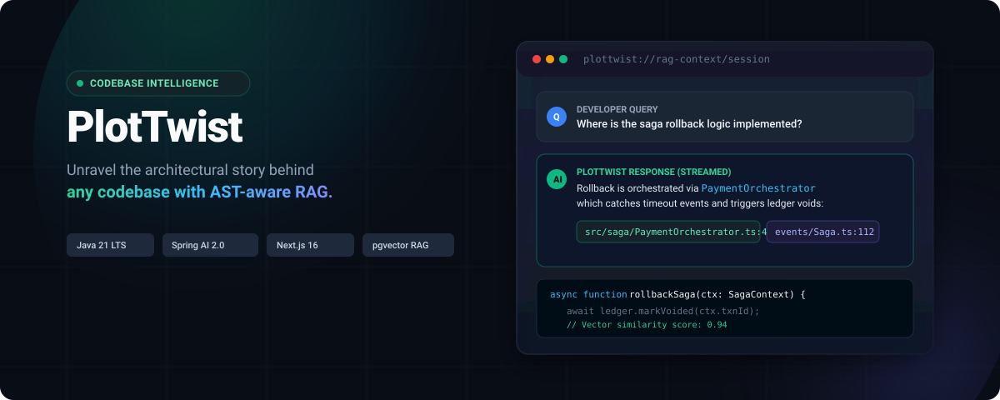
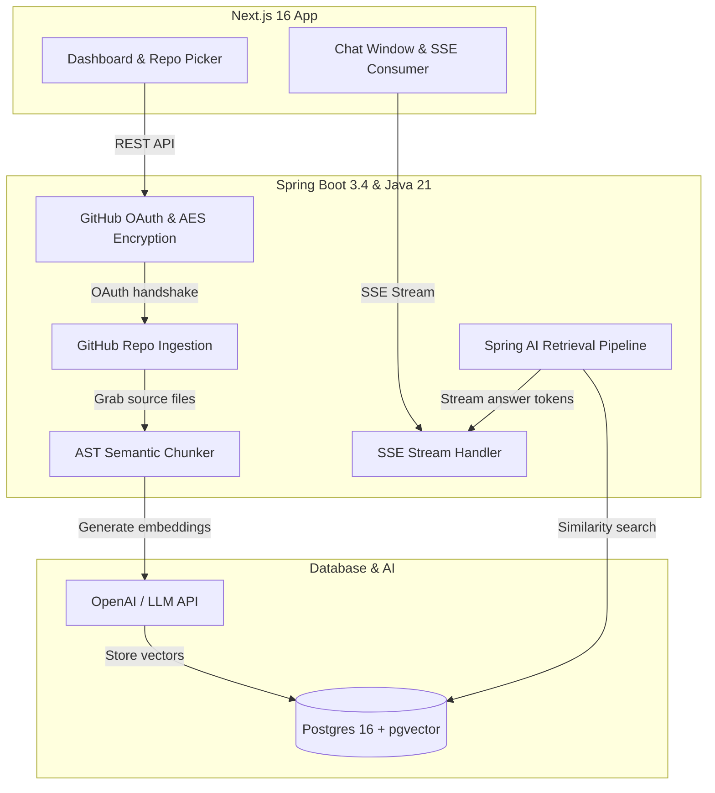

<p align="center">
  
</p>

<p align="center">
  <a href="https://plottwist-79.vercel.app/">
    
  </a>
</p>

<p align="center">
  <strong>Chat with your codebase without the guesswork.</strong><br/>
  Index any GitHub repo, ask questions in plain English, and get grounded answers with clickable line citations.<br/>
  <a href="https://plottwist-79.vercel.app/"><strong>Launch PlotTwist Web App &rarr;</strong></a>
</p>

<p align="center">
  <a href="https://plottwist-79.vercel.app/"></a>
  <a href="LICENSE"></a>
  <a href="https://adoptium.net/"></a>
  <a href="https://spring.io/projects/spring-boot"></a>
  <a href="https://spring.io/projects/spring-ai"></a>
  <a href="https://nextjs.org/"></a>
  <a href="https://github.com/pgvector/pgvector"></a>
</p>

---

## Why we built this

Ever clone a project, try to find where a single feature lives, and end up with 30 tabs open and no idea what's going on? 

Most codebases don't have good documentation. Even when they do, docs get outdated fast. You're usually stuck regex-grepping for variable names or asking the one teammate who remembers how the plumbing works.

**PlotTwist** fixes that. You link your GitHub, pick a repo, and let it index. From there, you can just ask questions like *"Where do we handle expired auth tokens?"* or *"Walk me through the payment checkout flow"*. 

PlotTwist pulls up the relevant code chunks from PostgreSQL vector search, streams the explanation back in real-time, and gives you clickable chips pointing to the exact lines on GitHub so you can verify it yourself.

```
The usual way                                 With PlotTwist
─────────────────────────────                 ─────────────────────────────────────
• Cmd+F across 40 files                       • Just ask in plain English
• Reading 3-year-old docs                     • Always grounded in current code
• Guessing cross-service dependencies         • Instant semantic search via pgvector
• Hallucinated answers from generic AI        • Clickable line citations back to GitHub
```

---

## What's under the hood

### Smart code chunking (not just blind text splitting)
Splitting code every 500 characters usually cuts right through the middle of a function or class. PlotTwist parses code along syntax boundaries so functions, classes, and interfaces stay together as complete thoughts.

### pgvector for lightning-fast retrieval
We store code embeddings directly in PostgreSQL using `pgvector` with HNSW indexing. Searching through thousands of code chunks takes less than 350ms.

### Clickable source citations
Whenever PlotTwist explains something, it cites the exact files and line numbers it used. Click any chip (`src/auth/jwt.ts:L42-80`) and it opens right up in GitHub.

### Real-time streaming
No waiting for a full paragraph to load. Tokens stream into the UI as they're generated over Server-Sent Events (SSE).

### Encrypted tokens at rest
Your GitHub personal tokens are never stored in plain text. Everything gets encrypted with AES-256 GCM using PBKDF2-derived keys before hitting the database.

---

## How it works



---

## Tech stack

- **Frontend**: Next.js 16 (App Router, Turbopack), React 19, TypeScript, Tailwind CSS v4, Base UI, TanStack Query
- **Backend**: Java 21 LTS, Spring Boot 3.4+, Spring AI 2.0+, Spring Security (OAuth2), Hibernate 7 / JPA
- **Database**: PostgreSQL 16 with `pgvector`
- **Containers**: Docker Compose (runs Postgres on port `5433` so it doesn't mess with your local port `5432`)

---

## Getting started

### What you'll need
- Java 21 LTS (Temurin recommended)
- Node.js 20+
- Docker Desktop (for Postgres + pgvector)
- A GitHub account (takes 2 minutes to create an OAuth app)
- An OpenAI API key

---

### 1. Spin up the database

We've got a Docker Compose file ready to go with PostgreSQL and `pgvector`:

```bash
docker compose up -d
```

*(We map it to port `5433` so it doesn't clash with any PostgreSQL instance you might already have on port `5432`.)*

Check that it's running:
```bash
docker ps --filter "name=plottwist-postgres"
```

---

### 2. Set up GitHub OAuth

1. Hop over to **GitHub Settings → Developer settings → OAuth Apps → New OAuth App**.
2. Put in:
   - **Application Name**: `PlotTwist`
   - **Homepage URL**: `http://localhost:3000`
   - **Authorization callback URL**: `http://localhost:8080/login/oauth2/code/github`
3. Click **Register**, generate a **Client Secret**, and copy both the Client ID and Secret.

---

### 3. Start the backend

#### On Windows (PowerShell):
```powershell
cd backend

# Point to Java 21
$env:JAVA_HOME = "C:\Program Files\Eclipse Adoptium\jdk-21.0.4.7-hotspot"

# Set your keys
$env:GITHUB_CLIENT_ID = "your_github_client_id"
$env:GITHUB_CLIENT_SECRET = "your_github_client_secret"
$env:OPENAI_API_KEY = "your_openai_api_key"

# Fire it up
.\mvnw.cmd spring-boot:run
```

#### On Mac / Linux:
```bash
cd backend
export GITHUB_CLIENT_ID="your_github_client_id"
export GITHUB_CLIENT_SECRET="your_github_client_secret"
export OPENAI_API_KEY="your_openai_api_key"

./mvnw spring-boot:run
```

The backend boots up on **`http://localhost:8080`**.

---

### 4. Start the frontend

In another terminal window:

```bash
cd client
npm install
npm run dev
```

Head over to **`http://localhost:3000`** (or try out the live production deployment at **[plottwist-79.vercel.app](https://plottwist-79.vercel.app/)**), click **Continue with GitHub**, and you're good to go.

---

## Project layout

```
plottwist/
├── .github/
│   ├── assets/hero-banner.svg   # Header banner
│   └── workflows/ci.yml         # GitHub Actions build check
├── backend/
│   ├── src/main/java/plottwist/backend/
│   │   ├── config/              # Security, CORS, crypto, Jackson beans
│   │   ├── controllers/         # REST & SSE streaming endpoints
│   │   ├── dto/                 # Request/response shapes
│   │   ├── entity/              # User, Repo, ChatSession tables
│   │   ├── exceptions/          # Error responses
│   │   ├── repository/          # JPA data access
│   │   ├── security/            # OAuth login & token encryption
│   │   └── services/
│   │       ├── ai/              # Prompt builder, retriever, SSE streaming
│   │       ├── github/          # Rate-limited repo crawler
│   │       └── indexing/        # AST chunker & vector indexer
│   ├── src/main/resources/
│   │   └── application.properties
│   └── pom.xml
├── client/
│   ├── app/
│   │   ├── auth/callback/       # OAuth redirect handler
│   │   ├── chat/[repoId]/       # Chat interface
│   │   ├── dashboard/           # Repo list & indexing status
│   │   ├── login/               # Sign-in page
│   │   ├── globals.css          # Theme & styles
│   │   └── page.tsx             # Landing page
│   ├── components/
│   │   ├── chat/                # Composer, markdown, citation chips
│   │   ├── dashboard/           # Repo cards, sync triggers
│   │   ├── icons/               # PlotTwist SVG logos
│   │   └── ui/                  # Base UI components
│   ├── hooks/                   # React Query & SSE hooks
│   └── lib/                     # API helpers, route configs
├── docker/
│   └── postgres/
│       └── init-extensions.sql  # Sets up pgvector extension
├── docker-compose.yml           # Database container
├── LICENSE                      # MIT License
└── README.md
```

---

## API endpoints

| Endpoint | Method | What it does | Auth required? |
|---|:---:|---|:---:|
| `/` | `GET` | Health check & server status | No |
| `/api/auth/me` | `GET` | Get current logged-in user profile | Yes |
| `/api/auth/logout` | `POST` | Log out and clear cookies | Yes |
| `/api/repos` | `GET` | List user's connected GitHub repos | Yes |
| `/api/repos/{id}/index` | `POST` | Trigger repository indexing & vector embedding | Yes |
| `/api/repos/{id}/index-status` | `GET` | Check current indexing progress | Yes |
| `/api/repos/{id}/sessions` | `GET` | Get chat session history for a repo | Yes |
| `/api/repos/{id}/sessions` | `POST` | Start a new chat session | Yes |
| `/api/repos/{id}/sessions/{sid}/messages` | `GET` | Get messages from a specific chat | Yes |
| `/api/chat/stream` | `GET` | Stream AI answer tokens over SSE | Yes |

---

## Contributing

Want to help make PlotTwist better? We'd love your help:

1. Fork the repo
2. Make your branch (`git checkout -b feature/cool-idea`)
3. Commit your changes (`git commit -m 'feat: add something cool'`)
4. Push to your branch (`git push origin feature/cool-idea`)
5. Open a Pull Request

---

## License

PlotTwist is open-source under the [MIT License](LICENSE).
