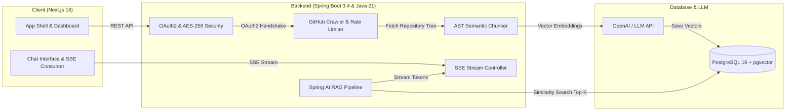

# PlotTwist

> An intelligent, retrieval-augmented codebase engine that lets you interrogate repositories with AST-aware chunking and verified line-by-line citations.

[](LICENSE)
[](https://adoptium.net/)
[](https://spring.io/projects/spring-boot)
[](https://spring.io/projects/spring-ai)
[](https://nextjs.org/)
[](https://github.com/pgvector/pgvector)

---

## Overview

Navigating an unfamiliar or legacy repository often means manually tracing calls across dozens of files, deciphering complex dependency trees, and guessing how modules connect.

**PlotTwist** bridges this gap by indexing any GitHub repository into an AST-aware vector store and providing a low-latency chat interface powered by Spring AI. Every answer is grounded in your actual code, complete with clickable source chips that point directly to the exact files and line ranges in your repository.

---

## Key Features

- **AST-Aware Semantic Chunking**: Unlike naive fixed-character splitting, PlotTwist understands programming syntax (classes, methods, interfaces, modules) and avoids breaking chunks mid-logic.
- **pgvector Vector Store**: High-dimensional embeddings stored directly in PostgreSQL with HNSW indexing and cosine similarity for sub-second retrieval.
- **Verified Source Citations**: Every AI assertion is accompanied by source chips linking to the exact file and lines on GitHub.
- **Real-Time Token Streaming**: Low-latency token streaming over Server-Sent Events (SSE) from Spring AI to the client.
- **AES-256 GCM Token Encryption**: User GitHub OAuth tokens are encrypted at rest with PBKDF2 salt derivation before being persisted.
- **Adaptive Rate Limiting**: Token-bucket rate limiter that respects secondary GitHub API limits during large repository crawls.
- **Modern Web Interface**: Built with Next.js 16 (App Router), Tailwind CSS v4, Base UI, and light/dark mode support.

---

## Architecture



### Stack Breakdown

- **Frontend**: Next.js 16 (Turbopack, App Router), React 19, TypeScript, Tailwind CSS v4, Base UI, TanStack Query
- **Backend**: Java 21 LTS, Spring Boot 3.4+, Spring AI 2.0+, Spring Security 6 (OAuth2), Hibernate 7 / JPA
- **Database**: PostgreSQL 16 with `pgvector` extension
- **Infrastructure**: Docker & Docker Compose, GitHub Actions CI

---

## Quickstart

### Prerequisites

- Java 21 LTS (`Adoptium Temurin 21` recommended)
- Node.js 20+ and npm
- Docker Desktop
- GitHub account (for OAuth credentials)
- OpenAI API key (or OpenAI-compatible local model)

---

### 1. Start the Database

Run PostgreSQL with pgvector enabled via Docker Compose:

```bash
docker compose up -d
```

> **Note**: Port `5433` is mapped to avoid port collisions with any local PostgreSQL instance already running on default port `5432`.

Verify the container is running:
```bash
docker ps --filter "name=plottwist-postgres"
```

---

### 2. Configure GitHub OAuth

1. Navigate to **GitHub Settings → Developer settings → OAuth Apps → New OAuth App**.
2. Set the following fields:
   - **Application Name**: `PlotTwist`
   - **Homepage URL**: `http://localhost:3000`
   - **Authorization callback URL**: `http://localhost:8080/login/oauth2/code/github`
3. Click **Register application**, generate a **Client Secret**, and note down both your Client ID and Client Secret.

---

### 3. Start the Backend

In PowerShell:
```powershell
cd backend

# Point to your Java 21 JDK installation
$env:JAVA_HOME = "C:\Program Files\Eclipse Adoptium\jdk-21.0.4.7-hotspot"

# Set your secrets
$env:GITHUB_CLIENT_ID = "your_github_client_id"
$env:GITHUB_CLIENT_SECRET = "your_github_client_secret"
$env:OPENAI_API_KEY = "your_openai_api_key"

# Run Spring Boot
.\mvnw.cmd spring-boot:run
```

In Bash (macOS / Linux):
```bash
cd backend
export GITHUB_CLIENT_ID="your_github_client_id"
export GITHUB_CLIENT_SECRET="your_github_client_secret"
export OPENAI_API_KEY="your_openai_api_key"

./mvnw spring-boot:run
```

The Spring Boot backend will start on `http://localhost:8080`.

---

### 4. Start the Frontend

In a separate terminal:

```bash
cd client
npm install
npm run dev
```

The web client will be available at `http://localhost:3000`.

---

## Project Structure

```
plottwist/
├── .github/
│   └── workflows/
│       └── ci.yml               # Automated CI for Java 21 & Next.js
├── backend/
│   ├── src/main/java/plottwist/backend/
│   │   ├── config/              # Security, CORS, Crypto, Jackson configuration
│   │   ├── controllers/         # REST & SSE streaming endpoints
│   │   ├── dto/                 # Request/response records
│   │   ├── entity/              # JPA entities (User, Repository, ChatSession)
│   │   ├── exceptions/          # Centralised error handling
│   │   ├── repository/          # Spring Data JPA repositories
│   │   ├── security/            # GitHub OAuth2 user principal & handlers
│   │   └── services/
│   │       ├── ai/              # Prompt builders, context retrievers, SSE handlers
│   │       ├── github/          # Rate-limited GitHub API crawler
│   │       └── indexing/        # AST chunker & pgvector indexer
│   ├── src/main/resources/
│   │   └── application.properties
│   └── pom.xml
├── client/
│   ├── app/
│   │   ├── auth/callback/       # OAuth callback landing page
│   │   ├── chat/[repoId]/       # Interactive codebase chat UI
│   │   ├── dashboard/           # Repository list & indexing progress
│   │   ├── login/               # Sign in page
│   │   ├── globals.css          # Design system & theme tokens
│   │   └── page.tsx             # Landing page
│   ├── components/
│   │   ├── chat/                # Composer, markdown renderer, citation chips
│   │   ├── dashboard/           # Repo cards, sync buttons, stats
│   │   ├── icons/               # PlotTwist brand icons
│   │   └── ui/                  # Base UI component primitives
│   ├── hooks/                   # React Query & SSE streaming hooks
│   └── lib/                     # API client, nav configs, query keys
├── docker/
│   └── postgres/
│       └── init-extensions.sql  # CREATE EXTENSION IF NOT EXISTS vector;
├── docker-compose.yml           # pgvector container configuration
└── README.md
```

---

## API Reference

| Method | Endpoint | Description | Auth Required |
|:---|:---|:---|:---:|
| `GET` | `/` | API status and health check | No |
| `GET` | `/api/auth/me` | Fetch authenticated user profile | Yes |
| `POST` | `/api/auth/logout` | Invalidate session and clear auth cookies | Yes |
| `GET` | `/api/repos` | List connected GitHub repositories | Yes |
| `POST` | `/api/repos/{id}/index` | Trigger AST chunking & vector indexing | Yes |
| `GET` | `/api/repos/{id}/index-status` | Poll current repository indexing progress | Yes |
| `GET` | `/api/repos/{id}/sessions` | Fetch chat session history for repository | Yes |
| `POST` | `/api/repos/{id}/sessions` | Create a new chat session | Yes |
| `GET` | `/api/repos/{id}/sessions/{sid}/messages` | Get message history for a specific session | Yes |
| `GET` | `/api/chat/stream` | Server-Sent Events (SSE) AI response stream | Yes |

### SSE Stream Protocol

Requests to `/api/chat/stream` return a continuous stream of events:

```http
event: message
data: {"type":"token","content":"The authentication service"}

event: message
data: {"type":"token","content":" encrypts tokens using AES-256 GCM."}

event: message
data: {"type":"citation","file":"src/config/CryptoConfig.java","lines":"20-25"}

event: message
data: {"type":"done"}
```

---

## Security

- **Encrypted Tokens**: GitHub access tokens are encrypted using AES-256 GCM before database insertion. The encryption key is derived using PBKDF2 with salt.
- **Minimal Scopes**: GitHub OAuth requests read-only repository permissions (`read:user,repo`) exclusively for retrieving code files.
- **Strict CORS**: The backend only accepts cross-origin requests from the configured frontend origin (`http://localhost:3000`).

---

## License

This project is licensed under the MIT License — see the [LICENSE](LICENSE) file for details.
