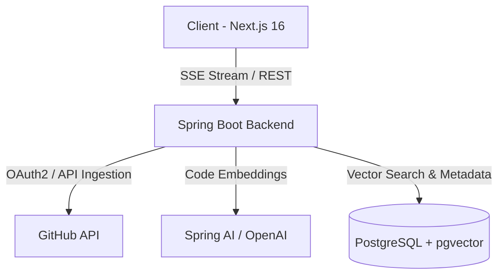

# 🌀 PlotTwist

> **AI-Powered Codebase Intelligence & Narrative RAG Engine**  
> Interrogate complex repositories, trace architectural execution flows, and chat with your code using grounded retrieval and verified source citations.

---

## Features

- **AST-Aware Code Chunking**: Preserves syntactic integrity (functions, classes, interfaces) rather than naive token splitting.
- **High-Performance pgvector RAG**: Code chunks embedded and indexed in PostgreSQL using cosine distance vector similarity.
- **Clickable Source Citations**: Every AI response provides verifiable links directly to lines in your GitHub repository.
- **Real-Time Token Streaming**: Low-latency Server-Sent Events (SSE) streaming from Spring AI directly to the React frontend.
- **Enterprise-Grade Token Security**: GitHub OAuth access tokens encrypted at rest via AES-256 GCM.
- **Adaptive Rate Limiting**: Intelligent token bucket rate limiting guarding GitHub API limits during repository ingestion.
- **Modern Responsive Design**: Next.js 16 with Turbopack, Tailwind CSS v4, Base UI primitives, dark/light themes, and glassmorphic micro-animations.

---

## 🏛️ System Architecture



### Technology Stack

| Layer | Technologies |
|---|---|
| **Frontend** | Next.js 16 (App Router, Turbopack), React 19, TypeScript, Tailwind CSS v4, Base UI, TanStack Query |
| **Backend** | Java 21, Spring Boot 3.4+, Spring Security OAuth2, Spring AI 2.0+, Hibernate / JPA |
| **Storage & Vectors** | PostgreSQL 16 with `pgvector` extension enabled |
| **Orchestration** | Docker & Docker Compose |

---

##  Quickstart Guide

### 1. Prerequisites

- **Java 21 LTS** (Eclipse Adoptium Temurin recommended)
- **Node.js 20+** & **npm**
- **Docker & Docker Compose**
- **GitHub OAuth App** (Client ID & Secret)
- **OpenAI API Key** (or compatible local LLM)

### 2. Start PostgreSQL with pgvector

```bash
docker compose up -d
```

This starts PostgreSQL on port `5432` with the `pgvector` extension preloaded.

### 3. Backend Setup

Create or update `backend/src/main/resources/application.properties` with your credentials:

```properties
SPRING_SECURITY_OAUTH2_CLIENT_REGISTRATION_GITHUB_CLIENT_ID=your-client-id
SPRING_SECURITY_OAUTH2_CLIENT_REGISTRATION_GITHUB_CLIENT_SECRET=your-client-secret
SPRING_AI_OPENAI_API_KEY=your-openai-key
ENCRYPTION_SECRET=your-32-byte-hex-key
```

Run the backend:

```bash
cd backend
./mvnw spring-boot:run
```

The Spring Boot backend will start on `http://localhost:8080`.

### 4. Client Setup

```bash
cd client
npm install
npm run dev
```

The client will be running on `http://localhost:3000`.

---

## 📡 Core API Endpoints

| Method | Endpoint | Description |
|---|---|---|
| `GET` | `/api/auth/me` | Fetch authenticated user profile & GitHub info |
| `POST` | `/api/auth/logout` | Invalidate session & clear cookies |
| `GET` | `/api/repos` | List synchronized GitHub repositories |
| `POST` | `/api/repos/{id}/index` | Trigger AST chunking & vector embedding |
| `GET` | `/api/repos/{id}/index-status` | Poll real-time indexing progress |
| `GET` | `/api/repos/{id}/sessions` | Fetch chat session history |
| `POST` | `/api/repos/{id}/sessions` | Create a new conversation session |
| `GET` | `/api/chat/stream` | Server-Sent Events (SSE) AI streaming |

---

## 🛡️ Security & Privacy

- Read-only access requested during GitHub OAuth authorization.
- Token encryption at rest using AES-GCM with PBKDF2 salt derivation.
- Strict CORS configuration separating API and frontend domains.

---

## 📄 License

MIT © [PlotTwist](https://github.com/sanjanamandal1/plottwist)
