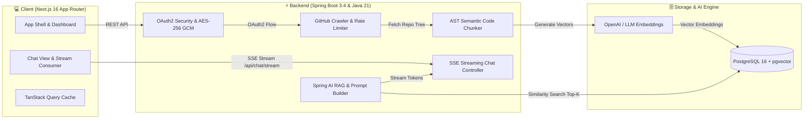

<div align="center">

# 🌀 PlotTwist 
### *Unravel the narrative behind any codebase with conversational intelligence & RAG* 📖💡

[](https://github.com/sanjanamandal1/plottwist/stargazers)
[](LICENSE)
[](https://adoptium.net/)
[](https://spring.io/projects/spring-boot)
[](https://spring.io/projects/spring-ai)
[](https://nextjs.org/)
[](https://github.com/pgvector/pgvector)

<br/>

> **"Every complex repository has a story to tell. PlotTwist helps you find the clues, connect the dots, and solve architectural mysteries in seconds."** 🕵️‍♀️🔍

[Live Demo](#-quickstart-guide) • [Features](#-magical-features) • [ Architecture](#-system-architecture) • [Quickstart](#-quickstart-guide) • [API Reference](#-rest--streaming-api) • [ Contributing](#-contributing)

---

</div>

## Why PlotTwist?

Onboarding onto a legacy monolith or exploring unfamiliar open-source code can feel like diving into a labyrinth without a map. **PlotTwist** turns code exploration into an engaging, conversational journey:

- 🧩 **No more blind file skimming**: Ask high-level architectural questions and receive pinpointed explanations.
- 🎯 **100% Grounded Citations**: Every single answer includes clickable reference chips directly linked to the exact GitHub source lines.
- ⚡ **Real-Time Token Streaming**: Watch the AI analyze your code token-by-token with zero lag via Server-Sent Events (SSE).
- 🔐 **Privacy by Design**: Sensitive GitHub access tokens are encrypted at rest with AES-256 GCM using PBKDF2 salt derivation.

---

## 🎀 Magical Features

| Feature | Description |
|:---|:---|
| 🧠 **AST-Aware Chunking** | Code isn't plain prose! PlotTwist parses function scopes, class hierarchies, and interfaces so semantic meaning is never lost during token cuts. |
| 🔮 **pgvector RAG Store** | High-dimensional embeddings stored directly in PostgreSQL with `HNSW` indexing and cosine similarity for sub-second retrieval. |
| 🏷️ **Clickable Source Chips** | AI responses provide verified file and line citations (`src/auth/token.ts:L45-80`) with one-click navigation. |
| 🌊 **Reactive SSE Streaming** | Stream responses smoothly using Spring AI and Spring MVC Server-Sent Events straight to the React interface. |
| 🛡️ **AES-256 GCM Encryption** | Zero plain-text token exposure. Personal GitHub OAuth tokens are cryptographically sealed before database persistence. |
| ⏱️ **Adaptive Rate Limiting** | Custom token-bucket rate limiter that respects secondary GitHub API thresholds during deep repository ingestion. |
| 🎨 **Lush Modern UI** | Built with Next.js 16 App Router, Tailwind CSS v4, Base UI, fluid animations, and native Dark/Light mode. |

---

## 🏛️ System Architecture



###  Technology Stack

```
Frontend:
├── Framework: Next.js 16.3 (Turbopack + App Router)
├── Language: TypeScript 5.0
├── Styling: Tailwind CSS v4 + tw-animate-css
├── Component Primitives: Base UI + Hugeicons + Lucide Icons
├── State & Queries: TanStack Query v5 (React Query)
└── Markdown & Syntax: React-Markdown + Remark-GFM + Rehype-Highlight

Backend:
├── Core: Java 21 LTS (Eclipse Adoptium Temurin)
├── Framework: Spring Boot 3.4+ / Spring Framework 6
├── AI Engine: Spring AI 2.0+ (OpenAI & Vector Store starters)
├── Security: Spring Security 6 OAuth2 Client + AES-256 GCM Crypto
├── Data & ORM: Spring Data JPA + Hibernate 7
└── Database: PostgreSQL 16 with pgvector extension
```

---

##  Quickstart Guide

### 📋 Prerequisites Checklist
- [x] **Java 21 LTS** installed (`java -version`)
- [x] **Node.js 20+** & **npm** installed (`node -v`)
- [x] **Docker Desktop** installed and running
- [x] **GitHub Account** (to create a quick OAuth App)
- [x] **OpenAI API Key** (or compatible local LLM endpoint)

---

### Step 1: Start PostgreSQL + pgvector 🐳

PlotTwist includes a Docker Compose configuration with PostgreSQL 16 and the `pgvector` extension preloaded on port `5433`:

```bash
docker compose up -d
```

> **Note**: Port `5433` is mapped to avoid conflicting with any default PostgreSQL running on port `5432`.

Verify it's healthy:
```bash
docker ps --filter "name=plottwist-postgres"
```

---

### Step 2: Register GitHub OAuth App 🐙

1. Go to [GitHub Developer Settings](https://github.com/settings/developers) → **OAuth Apps** → **New OAuth App**.
2. Fill in the parameters:
   - **Application Name**: `PlotTwist`
   - **Homepage URL**: `http://localhost:3000`
   - **Authorization callback URL**: `http://localhost:8080/login/oauth2/code/github`
3. Click **Register application**, generate a **Client Secret**, and copy both your **Client ID** and **Client Secret**.

---

### Step 3: Run the Spring Boot Backend ☕

Open your terminal, set your credentials, and start the backend:

#### On Windows (PowerShell):
```powershell
cd backend

# Point to your Java 21 JDK installation
$env:JAVA_HOME = "C:\Program Files\Eclipse Adoptium\jdk-21.0.4.7-hotspot"

# Set your secrets
$env:GITHUB_CLIENT_ID = "your_github_client_id"
$env:GITHUB_CLIENT_SECRET = "your_github_client_secret"
$env:OPENAI_API_KEY = "your_openai_api_key"

# Run Spring Boot
.\mvnw.cmd spring-boot:run
```

#### On macOS / Linux (Bash):
```bash
cd backend
export GITHUB_CLIENT_ID="your_github_client_id"
export GITHUB_CLIENT_SECRET="your_github_client_secret"
export OPENAI_API_KEY="your_openai_api_key"

./mvnw spring-boot:run
```

The backend will boot up with the PlotTwist banner on:  
👉 **`http://localhost:8080`**

---

### Step 4: Run the Next.js Frontend 💻

In a new terminal window:

```bash
cd client
npm install
npm run dev
```

Open your browser to:  
👉 **`http://localhost:3000`** 

---

## 📁 Project Structure

```
plottwist/
├── .github/
│   └── workflows/
│       └── ci.yml               # Automated CI pipeline for Java 21 & Next.js
├── backend/
│   ├── src/main/java/plottwist/backend/
│   │   ├── config/              # Security, CORS, Crypto & App beans
│   │   ├── controllers/         # REST & SSE streaming endpoints
│   │   ├── dto/                 # Request/response records
│   │   ├── entity/              # JPA entities (User, Repository, Sessions)
│   │   ├── exceptions/          # Centralised error handling
│   │   ├── repository/          # Spring Data JPA repositories
│   │   ├── security/            # GitHub OAuth2 user principal & handlers
│   │   └── services/            # Core business logic
│   │       ├── ai/              # Prompt builders, context retrievers, SSE
│   │       ├── github/          # Rate-limited GitHub API crawler
│   │       └── indexing/        # AST chunker & pgvector indexer
│   ├── src/main/resources/
│   │   └── application.properties
│   └── pom.xml                  # Maven dependencies & Java 21 config
├── client/
│   ├── app/
│   │   ├── auth/callback/       # OAuth token sync page
│   │   ├── chat/[repoId]/       # Interactive codebase chat UI
│   │   ├── dashboard/           # Repository explorer & indexing status
│   │   ├── login/               # Sign in with GitHub page
│   │   ├── globals.css          # Tailwind CSS v4 design tokens
│   │   └── page.tsx             # Visual landing page & feature showcase
│   ├── components/
│   │   ├── chat/                # Composer, markdown renderer, citation chips
│   │   ├── dashboard/           # Repo cards, sync triggers, metrics
│   │   ├── icons/               # Custom PlotTwist brand icons
│   │   └── ui/                  # Base UI button, modal, dropdown primitives
│   ├── hooks/                   # React Query & SSE streaming hooks
│   └── lib/                     # API client, nav configs, query keys
├── docker/
│   └── postgres/
│       └── init-extensions.sql  # CREATE EXTENSION IF NOT EXISTS vector;
├── docker-compose.yml           # pgvector container service
└── README.md
```

---

## 📡 REST & Streaming API

| Method | Endpoint | Description | Auth Required |
|:---:|:---|:---|:---:|
| `GET` | `/` | API status and greeting | ❌ |
| `GET` | `/api/auth/me` | Current authenticated user profile | ✅ |
| `POST` | `/api/auth/logout` | Invalidate session & clear cookies | ✅ |
| `GET` | `/api/repos` | List synchronized GitHub repositories | ✅ |
| `POST` | `/api/repos/{id}/index` | Trigger AST chunking & vector ingestion | ✅ |
| `GET` | `/api/repos/{id}/index-status` | Real-time indexing progress polling | ✅ |
| `GET` | `/api/repos/{id}/sessions` | Fetch conversation sessions for repo | ✅ |
| `POST` | `/api/repos/{id}/sessions` | Create a new chat session | ✅ |
| `GET` | `/api/repos/{id}/sessions/{sid}/messages` | Message history for a session | ✅ |
| `GET` | `/api/chat/stream` | Server-Sent Events (SSE) AI streaming | ✅ |

### Sample SSE Stream Response
```http
event: message
data: {"type":"token","content":"The authentication pipeline"}

event: message
data: {"type":"token","content":" uses AES-256 GCM encryption."}

event: message
data: {"type":"citation","file":"src/config/CryptoConfig.java","lines":"20-25"}

event: message
data: {"type":"done"}
```

---

## 🛡️ Security & Privacy Practices

- 🔒 **Token Encryption**: Access tokens are never stored as plain text. AES-256 GCM encryption keys are dynamically derived via PBKDF2.
- 👓 **Read-Only Scope**: The GitHub OAuth app only requests `read:user,repo` to fetch files for chunking.
- 🌐 **Isolated CORS**: CORS headers are locked down to your Next.js frontend origin (`http://localhost:3000`).

---

## 🌸 Contributing

Contributions, questions, and feature suggestions are warmly welcomed!

1. Fork the Project 🍴
2. Create your Feature Branch (`git checkout -b feature/CuteFeature`)
3. Commit your Changes (`git commit -m 'feat: add a cute feature'`)
4. Push to the Branch (`git push origin feature/CuteFeature`)
5. Open a Pull Request 💌

---

<div align="center">

Made with 💖, Java 21 & Next.js for developers who want to understand their code better.  
**PlotTwist** © 2026 • [GitHub Repository](https://github.com/sanjanamandal1/plottwist)

⭐ *If you enjoy PlotTwist, don't forget to star the repo!* ⭐

</div>
